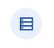

# **Apps usados**
- `Planilha`(BaseDeDados)

    **Crie uma dentro do drive:**

    **Caminho: `Novo` -> `Planilhas`**
    #
- `Apps Script`(Funções e validações)(Back-End)

    **Crie um dentro do drive:**

    **Caminho: `Novo` -> `Mais` -> `Script do Google Apps`**
    #
- `App Sheet`(Front-End)

    https://www.appsheet.com/

    **Crie um Projeto:**

    **Caminho: `Create` -> `App` -> `Start with existing data` -> `Nome do APP` -> `Other` -> `Selecionar planilha`**
    #

# **App Sheet(Front-End)**

### **Opção `Data` (Barra lateral)**

**Local onde ficam todos os dados puxados da planilha vinculada**


#
### **Opção `Table Settings` (barra superior)**`

**Local para definir permissões para usuário(Read-Only -> Somente Leitura)**


#
### **Opção `Regenerate Schema` (barra superior)**

**Atualiza a DataBase**

**Atualizar sempre que fizer alguma alteração tanto pelo App Sheet ou diretamente na planilha**

Ex: adicionar uma nova coluna na tabela


#
### **Coluna `_RowNumber` gerada no App Sheet - São as linhas laterais da planilha**


#
**Definimos o `id` sendo do tipo `Text`, pois assim o código é gerado com `letras` e `números`, ficando mais legível, compacto e com uma margem maior de possibilidades**

**Caminho: `Edit` -> `Auto Complete`:**

**Por padrão, o `id` já é gerado com a fórmula `UNIQUEID()` estabelecida como `initial value`**

#
## **Editar a Definição da coluna(Definir o tipo do campo, adicionar fórmulas...)**


**Caminho: `Edit` -> `Auto Complete`:**

- `App formula` - Valor gerado, mas **não pode ser alterado pelo usuário** 
- `initial value` - Valor gerado quando abre a tela e **pode ser alterado pelo usuário**
#
### **Campo de Imagem(`photo`)**
**Colocando o nome da coluna na tabela(BaseDeDados) sendo como `photo` e clicando para atualizar no AppSheet. Automaticamente é gerado um campo do tipo `Image`, onde podemos adicionar arquivos do tipo imagem(JPG, PNG...)** 

**Todas a imagens inseridas no campo `photo` são adicionadas em uma pasta gerada dentro do drive**
#
### **Campo de Endereço(`address`)**
**Colocando o nome da coluna na tabela(BaseDeDados) sendo como `address` e clicando para atualizar no AppSheet. Automaticamente é gerado um campo do tipo `Address`**
#
## **Altera nome da label**

**Caminho: `Edit` -> `Display` -> `Display name`**

**Definimos o nome entre `''`**

**Ex:** `'Nome'`
#
## **Visibilidade do campo(`Show`)**

**Caminho: `Edit` -> Desabilita a opção box `show?`**

**Desabilita a visibilidade do campo para o usuario, mas continua recebendo as informações desejadas**
#
## **Campo de email(`useremail`)**
**Colocando o nome da coluna na tabela(BaseDeDados) sendo como `useremail` e clicando para atualizar no AppSheet. Por padrão é gerado um campo do tipo `Text`**

**Adicionando a fórmula `USEREMAIL()` dentro do App formula - Essa fórmula pega o email do usuário que está acessando. Como adicionamos dentro do App formula, o usuário não consegue fazer nenhuma alteração**
#
## **Campo de Registro**

**Usando a fórmula `NOW()` dentro do App formula e definindo o tipo do campo para `DateTime` - Pegamos a `Data e Hora` que o usuário acessou**
#
## **Opção `Automation` (Barra lateral)**

**Crie uma nova tabela**
#
**Crie a automação:**

**Caminho: `Create my first automation` -> `Create a new bot` -> `Configure event` -> `Create a custom event` -> `Add a step` -> `Create a custom step` -> Clique em `New step` -> Selecione `Call a script` -> Crie uma `nova tabela` -> Selecione a `nova tabela` -> Em `Apps Script Project` selecione o seu projeto `Apps Script`**

**Quardando informações(Alteração, Delete...)**

**Criamos uma nova tabela onde vamos receber o `id``id_visitante`, ou seja, o `id` de quem fez a alteração**
#
# **Apps Script(Back-End)**
**É aonde definimos Funções e validações**

```
// Refere ao arquivo
var ss = SpreadsheetApp.openByUrl("")
```

- O nome da variável `ss` é definido como melhores práticas
- `SpreadsheetApp` - identifica o app da Google que estamos utilizando
- `.openByUrl("")` - onde passamos a URL da planilha desejada

```
// Refere a aba
var nomeDaAba = ss.getSheetByName("nomeDaAba")
```
